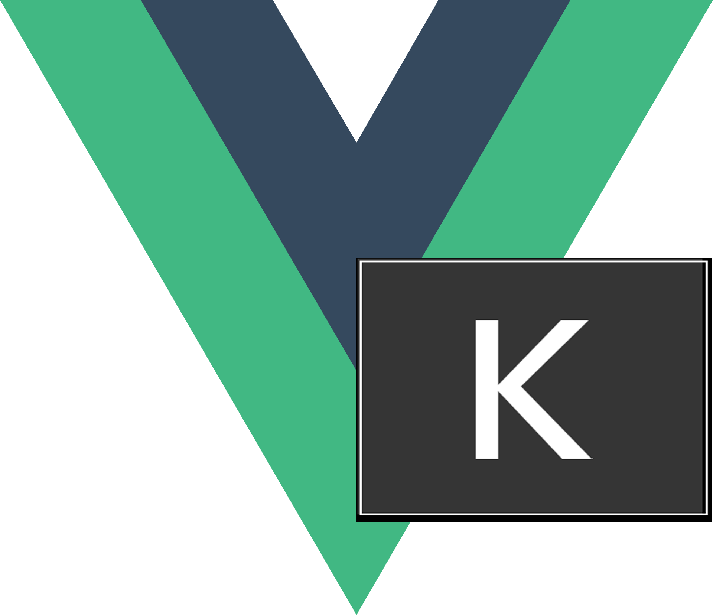

<!-- Improved compatibility of back to top link: See: https://github.com/othneildrew/Best-README-Template/pull/73 -->

<a name="readme-top"></a>

<!--
*** Thanks for checking out the Best-README-Template. If you have a suggestion
*** that would make this better, please fork the repo and create a pull request
*** or simply open an issue with the tag "enhancement".
*** Don't forget to give the project a star!
*** Thanks again! Now go create something AMAZING! :D
-->

<!-- PROJECT SHIELDS -->
<!--
*** I'm using markdown "reference style" links for readability.
*** Reference links are enclosed in brackets [ ] instead of parentheses ( ).
*** See the bottom of this document for the declaration of the reference variables
*** for contributors-url, forks-url, etc. This is an optional, concise syntax you may use.
*** https://www.markdownguide.org/basic-syntax/#reference-style-links
-->

[![Contributors][contributors-shield]][contributors-url]
[![Forks][forks-shield]][forks-url]
[![Stargazers][stars-shield]][stars-url]
[![Issues][issues-shield]][issues-url]
[![MIT License][license-shield]][license-url]
[![LinkedIn][linkedin-shield]][linkedin-url]

<!-- PROJECT LOGO -->
<br />
<div align="center">
  <a href="https://github.com/Mehdi-Mani/KeyDisplayVuePlugin">
    
  </a>

  <h3 align="center">KeyDisplay Vue 3 Plugin</h3>

  <p align="center">
    An awesome README template to jumpstart your projects!
    <br />
    <a href="https://github.com/Mehdi-Mani/KeyDisplayVuePlugin/issues">Report Bug</a>
    ·
    <a href="https://github.com/Mehdi-Mani/KeyDisplayVuePlugin/issues">Request Feature</a>
  </p>
</div>

<!-- TABLE OF CONTENTS -->
<details>
  <summary>Table of Contents</summary>
  <ol>
    <li>
      <a href="#about-the-project">About The Project</a>
      <ul>
        <li><a href="#built-with">Built With</a></li>
      </ul>
    </li>
    <li>
      <a href="#getting-started">Getting Started</a>
      <ul>
        <li><a href="#prerequisites">Prerequisites</a></li>
        <li><a href="#installation">Installation</a></li>
      </ul>
    </li>
    <li><a href="#usage">Usage</a></li>
    <li><a href="#roadmap">Roadmap</a></li>
    <li><a href="#contributing">Contributing</a></li>
    <li><a href="#license">License</a></li>
    <li><a href="#contact">Contact</a></li>
    <li><a href="#acknowledgments">Acknowledgments</a></li>
  </ol>
</details>

<!-- ABOUT THE PROJECT -->

## About The Project

![Product Name Screen Shot][product-screenshot1]

![Product Name Screen Shot][product-screenshot2]

KeyDisplayPlugin ,as the name implies, is a plugin for Vue 3 that displays key pressed on your screen.
KeyDisplayPlugin is a standalone component and require almost no dependencies.

<p align="right">(<a href="#readme-top">back to top</a>)</p>

### Built With

[![Vue][Vue.js]][Vue-url]

<p align="right">(<a href="#readme-top">back to top</a>)</p>

<!-- GETTING STARTED -->

## Getting Started

### Installation

To start using KeyDisplayPLugin:

1. Install KeyDisplayPlugin using your package manager.

- npm
  ```sh
  npm install npm@latest -g
  ```
- yarn
  ```sh
  yarn install npm@latest -g
  ```
- pnpm
  ```sh
  pnpm install npm@latest -g
  ```

2. Import the plugin and use

   ```ts
   import KeyDisplayPlugin from "@/KeyDisplayPlugin/dist/keyDisplay";
   import App from "./App.vue";

   const app = createApp(App);
   app.use(KeyDisplayPlugin);
   ```

3. Implement either the standalone

   ```ts

   ```

<p align="right">(<a href="#readme-top">back to top</a>)</p>

<!-- USAGE EXAMPLES -->

## Usage

Use this space to show useful examples of how a project can be used. Additional screenshots, code examples and demos work well in this space. You may also link to more resources.

_For more examples, please refer to the [Documentation](https://example.com)_

<p align="right">(<a href="#readme-top">back to top</a>)</p>

<!-- ROADMAP -->

## Roadmap

- [x] Initialize project
- [x] Add default styling options
- [x] Add Custom CSS support
- [ ] Add Custom messages support
- [ ] Add Custom events support

See the [open issues](https://github.com/othneildrew/Best-README-Template/issues) for a full list of proposed features (and known issues).

<p align="right">(<a href="#readme-top">back to top</a>)</p>

<!-- CONTRIBUTING -->

## Contributing

Contributions are what make the open source community such an amazing place to learn, inspire, and create. Any contributions you make are **greatly appreciated**.

If you have a suggestion that would make this better, please fork the repo and create a pull request. You can also simply open an issue with the tag "enhancement".
Don't forget to give the project a star! Thanks again!

1. Fork the Project
2. Create your Feature Branch (`git checkout -b feature/AmazingFeature`)
3. Commit your Changes (`git commit -m 'Add some AmazingFeature'`)
4. Push to the Branch (`git push origin feature/AmazingFeature`)
5. Open a Pull Request

<p align="right">(<a href="#readme-top">back to top</a>)</p>

<!-- LICENSE -->

## License

Distributed under the MIT License. See `LICENSE.txt` for more information.

<p align="right">(<a href="#readme-top">back to top</a>)</p>

<!-- CONTACT -->

## Contact

Mehdi Mani - mani.mehdi@outlook.com

Project Link: [https://github.com/Mehdi-Mani/KeyDisplayVuePlugin](https://github.com/Mehdi-Mani/KeyDisplayVuePlugin)

<p align="right">(<a href="#readme-top">back to top</a>)</p>

<!-- ACKNOWLEDGMENTS -->

## Acknowledgments

Use this space to list resources you find helpful and would like to give credit to. I've included a few of my favorites to kick things off!

- [Choose an Open Source License](https://choosealicense.com)
- [Img Shields](https://shields.io)

<p align="right">(<a href="#readme-top">back to top</a>)</p>

<!-- MARKDOWN LINKS & IMAGES -->
<!-- https://www.markdownguide.org/basic-syntax/#reference-style-links -->

[contributors-shield]: https://img.shields.io/github/contributors/Mehdi-Mani/KeyDisplayVuePlugin.svg?style=for-the-badge
[contributors-url]: https://github.com/Mehdi-Mani/KeyDisplayVuePlugin/graphs/contributors
[forks-shield]: https://img.shields.io/github/forks/Mehdi-Mani/KeyDisplayVuePlugin.svg?style=for-the-badge
[forks-url]: https://github.com/Mehdi-Mani/KeyDisplayVuePlugin/network/members
[stars-shield]: https://img.shields.io/github/stars/Mehdi-Mani/KeyDisplayVuePlugin.svg?style=for-the-badge
[stars-url]: https://github.com/Mehdi-Mani/KeyDisplayVuePlugin/stargazers
[issues-shield]: https://img.shields.io/github/issues/Mehdi-Mani/KeyDisplayVuePlugin.svg?style=for-the-badge
[issues-url]: https://github.com/Mehdi-Mani/KeyDisplayVuePlugin/issues
[license-shield]: https://img.shields.io/github/license/Mehdi-Mani/KeyDisplayVuePlugin.svg?style=for-the-badge
[license-url]: https://github.com/Mehdi-Mani/KeyDisplayVuePlugin/blob/master/LICENCE.txt
[linkedin-shield]: https://img.shields.io/badge/-LinkedIn-black.svg?style=for-the-badge&logo=linkedin&colorB=555
[linkedin-url]: https://www.linkedin.com/in/mehdi-mani/
[product-screenshot1]: images/exampleDark.png
[product-screenshot2]: images/exampleWhite.png
[Vue.js]: https://img.shields.io/badge/Vue.js-35495E?style=for-the-badge&logo=vuedotjs&logoColor=4FC08D
[Vue-url]: https://vuejs.org/
[Mitt-url]: https://github.com/developit/mitt
